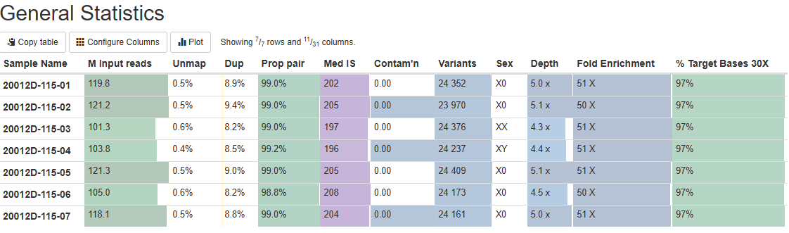

# Standard-Operational-Process-for-Whole-Exome-Sequencing
## OBJECTIVE
This SOP outlines the standardized bioinformatics workflow for processing Whole Exome Sequencing (WES) data. It describes the steps from raw FASTQ files to variant calling, annotation, and reporting, ensuring accurate, reproducible, and high-quality results suitable for research or clinical interpretation.

## Key Features
Support for paired-end FASTQ files (hg38 or GRCh38)
Quality control (MultiQC)
Adapter trimming and filtering (fastp)
Alignment using BWA-MEM
Post-alignment processing (SAMtools, Picard, GATK Best Practices)
Variant calling (GATK HaplotypeCaller or DeepVariant)
Annotation with VEP or SnpEff
Optional: CNV calling and structural variant detection
Output in VCF and annotated TSV/Excel formats
Modular and customizable pipeline steps

## MultiQC metrics

